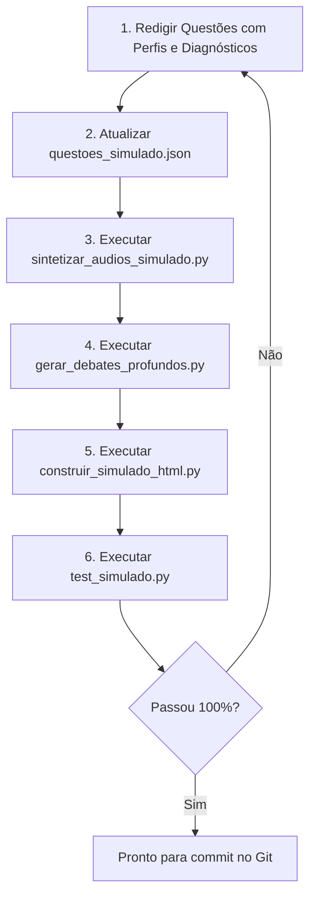

# Diretrizes e Padrão Obrigatório para Criação de Questões do Simulado ISO/IEC 17025:2017

> **Instrução para IA / Desenvolvedor:**  
> Sempre que for solicitado expandir o banco de dados do simulado, criar novas questões ou revisar questões existentes, siga **estritamente** este documento. Nenhuma questão deve ser inserida sem cumprir 100% dos critérios metrológicos, estruturais e multimídia aqui descritos.

---

## 1. Perfis Metrológicos e Segmentação

Cada questão deve ser atribuída a **um perfil específico**, permitindo ao usuário filtrar simulados direcionados ao seu papel organizacional:

| Perfil (`perfil`) | Ícone | Nome Exibido | Foco e Escopo Temático |
| :--- | :---: | :--- | :--- |
| `tecnico` | 🛠️ | **Corpo Técnico** | Execução de ensaios/calibrações, manuseio de itens de ensaio, validação e verificação de métodos, cálculo e declaração de incerteza de medição, cartas de controle, checagens intermediárias, calibração e manutenção de equipamentos, ensaios de proficiência (PEP). |
| `gerencial` | 👔 | **Corpo Gerencial** | Liderança e comprometimento, salvaguardas contra pressões comerciais/financeiras, identificação contínua de riscos à imparcialidade, política da qualidade, auditorias internas independentes, análise crítica pela direção, qualificação e compras de provedores externos. |
| `geral` | 🌐 | **Geral / Institucional** | Cultura metrológica corporativa, sigilo e confidencialidade, estrutura organizacional e personalidade jurídica, controle e proteção de dados e registros em TI, comunicação de reclamações e melhoria contínua. |

---

## 2. Níveis de Dificuldade e Seções da Norma

* **Seções da ISO/IEC 17025:2017:**
  * Seção 4: Requisitos Gerais (Imparcialidade e Confidencialidade)
  * Seção 5: Requisitos de Estrutura
  * Seção 6: Requisitos de Recursos (Pessoal, Instalações, Equipamentos, Rastreabilidade, Provedores)
  * Seção 7: Requisitos de Processo (Análise Crítica, Métodos, Amostragem, Registros, Incerteza, Validade dos Resultados, Relatórios, Reclamações, Trabalho Não Conforme, Controle de Dados)
  * Seção 8: Requisitos do Sistema de Gestão (Opções A e B, Documentação, Riscos e Oportunidades, Ações Corretivas, Auditorias, Análise Crítica)
* **Níveis:** `Básico`, `Intermediário`, `Avançado`.
* **Distribuição Recomendada:** Manter equilíbrio entre cenários teóricos da norma e situações de bancada/gestão vividas nos laboratórios da Eletronuclear.

---

## 3. Estrutura de Dados JSON (`questoes_simulado.json`)

Cada entrada no arquivo `questoes_simulado.json` deve conter a estrutura canônica completa:

```json
{
  "id": "Q_7.2_02",
  "clausula": "7.2",
  "clausula_iso": "7.2.1",
  "secao_raiz": "7",
  "nivel": "Intermediário",
  "tema": "Seleção e Verificação de Métodos",
  "perfil": "tecnico",
  "perfil_nome": "Corpo Técnico",
  "perfil_icone": "🛠️",
  "foco_perfil": "Bancada, métodos, verificação e ensaios",
  "enunciado": "Texto claro e contextualizado expondo a situação metrológica...",
  "alternativas": [
    {
      "letra": "A",
      "texto": "Texto da alternativa incorreta...",
      "audio_alt": "Audios_Simulado/Q_7.2_02_alt_A.mp3"
    },
    {
      "letra": "B",
      "texto": "Texto da alternativa correta...",
      "audio_alt": "Audios_Simulado/Q_7.2_02_alt_B.mp3"
    },
    {
      "letra": "C",
      "texto": "Texto da alternativa incorreta...",
      "audio_alt": "Audios_Simulado/Q_7.2_02_alt_C.mp3"
    },
    {
      "letra": "D",
      "texto": "Texto da alternativa incorreta...",
      "audio_alt": "Audios_Simulado/Q_7.2_02_alt_D.mp3"
    }
  ],
  "correta": "B",
  "justificativa": "Fundamentação técnica da norma para o gabarito oficial...",
  "explicacoes_detalhadas": {
    "A": {
      "por_que_esta_incorreta": "Explicação inédita e específica demonstrando o erro conceitual da opção A perante a norma.",
      "por_que_outra_e_correta": "A alternativa correta é a [B] porque atende expressamente ao item 7.2..."
    },
    "B": {
      "fundamentacao_acerto": "Você acertou com precisão técnica! O requisito 7.2 estabelece que..."
    },
    "C": {
      "por_que_esta_incorreta": "Explicação inédita e específica demonstrando por que a opção C viola a norma.",
      "por_que_outra_e_correta": "A alternativa correta é a [B] porque..."
    },
    "D": {
      "por_que_esta_incorreta": "Explicação inédita e específica apontando a armadilha da opção D.",
      "por_que_outra_e_correta": "A alternativa correta é a [B] porque..."
    }
  ],
  "item_id_referencia": "item_14_3",
  "audio_ref": "Trechos_Aulas/Parte_2/Aula_Parte2_Item_14_3_Verificacao_de_Metodos_Normalizados.mp3",
  "debate_podcast": "Podcasts_Simulado/Q_7.2_02_debate.mp3"
}
```

### Regras Mandatórias de Conteúdo:
1. **Sem Explicações Genéricas:** É terminantemente proibido utilizar explicações repetitivas ou genéricas como *"A alternativa adota uma premissa incorreta..."*. O diagnóstico deve citar a razão técnica concreta do erro daquela alternativa.
2. **Quatro Alternativas (A, B, C, D):** Exatamente uma alternativa correta e três distratores plausíveis.
3. **Distribuição Equilibrada do Gabarito (Sem Vício de Letra):** O gabarito jamais deve se concentrar em uma única letra (ex: B sempre correta). Deve haver uma distribuição equilibrada e alternada entre A, B, C e D (~25% para cada alternativa no banco), sem repetições consecutivas monótonas e garantindo que todas as alternativas sejam contempladas em cada seção da norma.

---

## 4. Padrão de Síntese de Áudio TTS (`Audios_Simulado/`)

Para cada questão, devem ser sintetizados **5 arquivos de áudio**:
* `Audios_Simulado/{qid}_enunciado.mp3`
* `Audios_Simulado/{qid}_alt_A.mp3`
* `Audios_Simulado/{qid}_alt_B.mp3`
* `Audios_Simulado/{qid}_alt_C.mp3`
* `Audios_Simulado/{qid}_alt_D.mp3`

### 4.1. Voz Padrão
* **Voz do Enunciado e Alternativas:** `pt-BR-FranciscaNeural` (Edge-TTS).

### 4.2. Fórmula Obrigatória de Abertura do Enunciado
O áudio do enunciado **NUNCA** deve conter prefixos com códigos técnicos crus como *"Questão Q..."* (que o leitor neural pronuncia de forma incorreta como *"qui ponto"*).  
A fórmula obrigatória e naturalizada é:
```python
texto_audio = f"Pergunta sobre o Requisito {q['clausula']}, {q['tema']}. {enunciado}"
```
*Exemplo:* `"Pergunta sobre o Requisito 4.2, Informações Obtidas de Terceiros e Sigilo. Ao receber informações confidenciais..."`

### 4.3. Dicionário Fonético Mandatório
Antes de enviar qualquer texto para síntese (enunciados, alternativas e debates), passe o texto pela função de fonetização:

```python
def phonetize_text(text: str) -> str:
    # 1. Pronúncia fonética de Standard Methods (stán-derd mé-thadz, contínuo sem pausas)
    text = re.sub(r'\bStandard Methods\b', 'stán-derd mé-thadz', text, flags=re.IGNORECASE)
    text = re.sub(r'\bStandard Method\b', 'stán-derd mé-thad', text, flags=re.IGNORECASE)
    
    # 2. Siglas normativas e institucionais
    text = text.replace("ISO/IEC", "ISO").replace("ISO 17025:2017", "ISO 17025")
    text = re.sub(r'\bCgcre\b', 'Sêgécre', text, flags=re.IGNORECASE)
    text = re.sub(r'\bCGCRE\b', 'Sêgécre', text, flags=re.IGNORECASE)
    text = re.sub(r'\bInmetro\b', 'In-metro', text, flags=re.IGNORECASE)
    text = re.sub(r'\bEMA\b', 'E-M-A', text)
    text = re.sub(r'\bPEP\b', 'P-E-P', text)
    text = re.sub(r'\bTNC\b', 'T-N-C', text)
    return text
```

---

## 5. Padrão de Podcasts de Debate Inéditos (`Podcasts_Simulado/`)

Para cada questão, deve ser gerado um podcast em formato MP3 estéreo:  
`Podcasts_Simulado/{qid}_debate.mp3` (duração alvo: **60 a 75 segundos**).

### 5.1. Vozes e Parâmetros
* **Thalita:** `pt-BR-ThalitaMultilingualNeural` | `rate="+14%"` | `pitch="+4Hz"`
* **Francisca:** `pt-BR-FranciscaNeural` | `rate="+10%"` | `pitch="+2Hz"`

### 5.2. Roteiro Dinâmico de 4 Turnos Alternados
O diálogo deve simular um bate-papo espontâneo e técnico entre duas especialistas sêniores:

1. **Turno 1 (Thalita):** Contextualiza o requisito e o tema no dia a dia laboratorial e pergunta o que costuma confundir profissionais em avaliações.
2. **Turno 2 (Francisca):** Expõe a maior pegadinha entre as opções erradas, cita o trecho da alternativa e explica o porquê de ser um erro técnico grave.
3. **Turno 3 (Thalita):** Valida a alternativa correta destacando sua concordância estrita com a ISO 17025.
4. **Turno 4 (Francisca):** Conclui com conselho prático conectando o requisito às auditorias da Cgcre e à rotina dos laboratórios da Eletronuclear.

### 5.3. Concatenação de Áudio
* As falas dos 4 turnos devem ser intercaladas por um silêncio acústico de 180 ms (`_silence_180ms.mp3`).
* **Atenção Técnica Crítica:** Na lista de concatenação do `ffmpeg` (`concat.txt`), os caminhos dos arquivos temporários e do arquivo de silêncio **devem ser caminhos absolutos** (`.resolve().as_posix()`) para evitar que o demuxer do ffmpeg aborte silenciosamente a união dos turnos.

---

## 6. Fluxo de Trabalho Passo a Passo para Novas Questões

Quando for solicitado criar $N$ novas questões:



1. **Modelar Questões:** Criar as questões com ID único sequencial (`Q_{clausula}_{seq}`), atribuindo perfil (`tecnico`, `gerencial` ou `geral`), distratores consistentes e diagnósticos inéditos.
2. **Atualizar Banco:** Salvar em [`questoes_simulado.json`](questoes_simulado.json).
3. **Sintetizar Áudios Básicos:**
   ```bash
   python scripts_processamento/sintetizar_audios_simulado.py
   ```
4. **Gerar Debates Aprofundados:**
   ```bash
   python scripts_processamento/gerar_debates_profundos.py
   ```
5. **Reconstruir Interface:**
   ```bash
   python scripts_processamento/construir_simulado_html.py
   ```
6. **Validar Auditoria:**
   ```bash
   python test_simulado.py
   ```
   *O teste deve retornar 0 falhas, confirmando integridade de áudios, durações de debates, banco JSON e interface HTML.*
